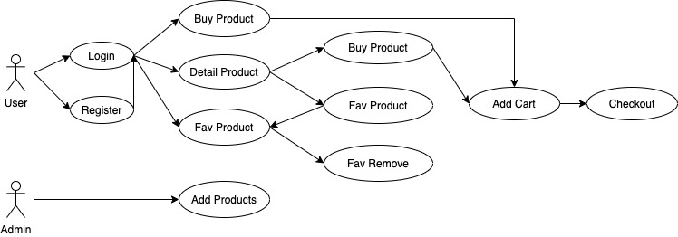
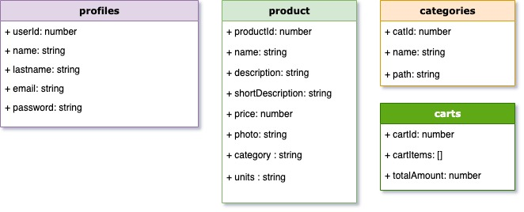
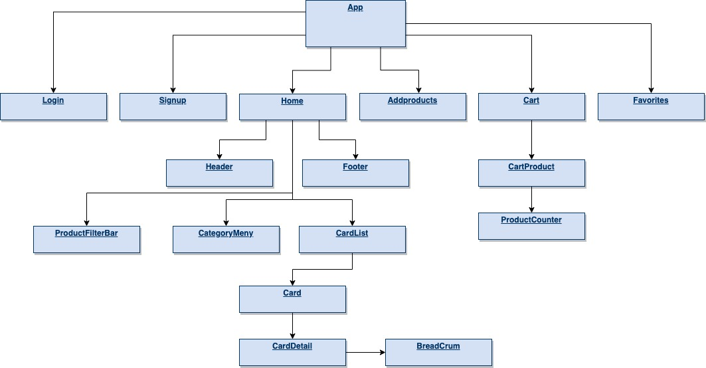
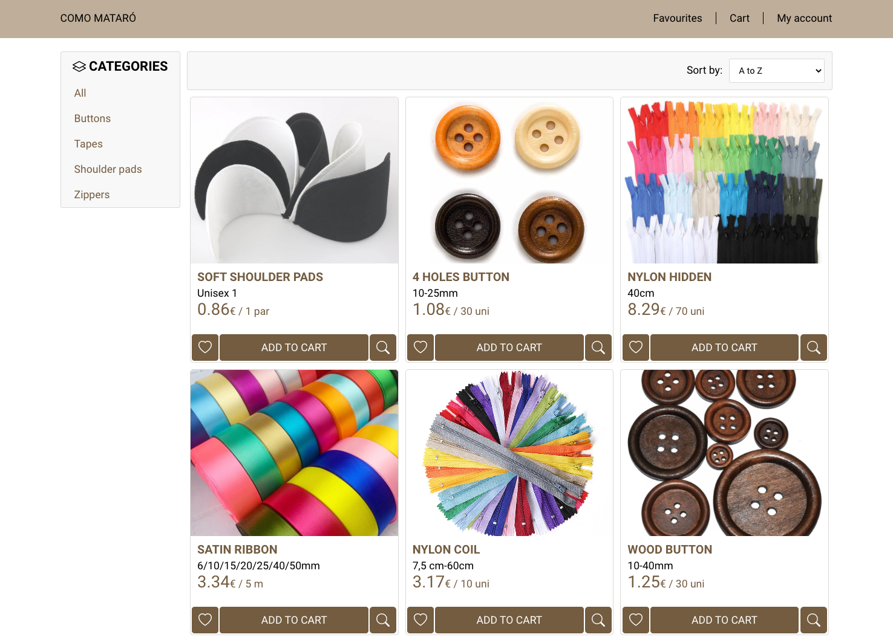
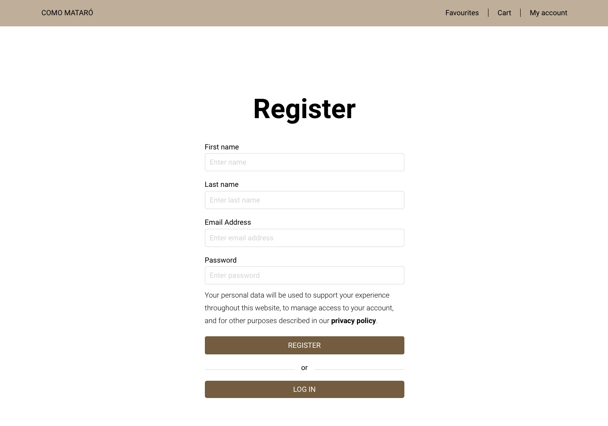
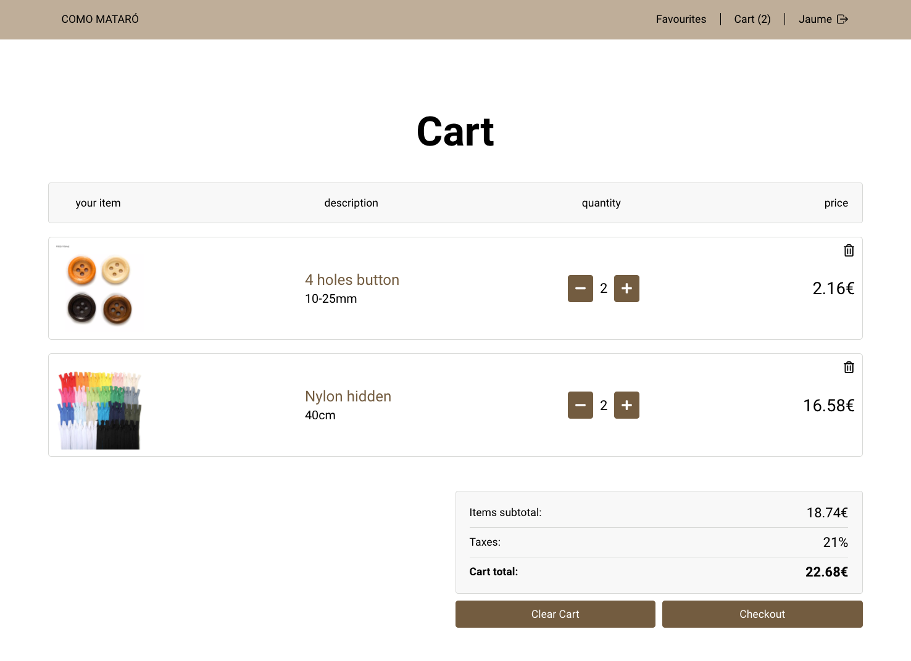
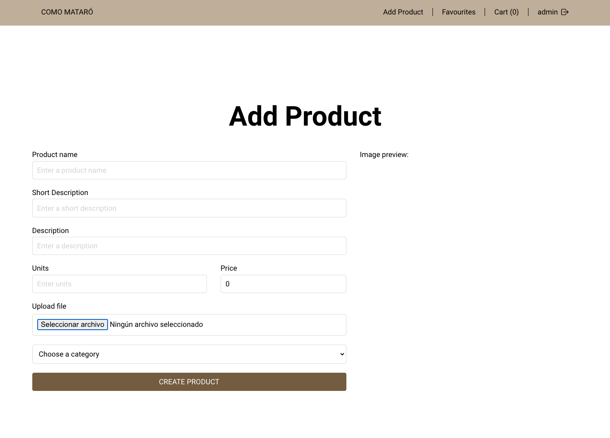

# COMO Mataró e-Commerce
Como Mataró is an ecommerce for a small family business. Thanks to this platform you can expand the market and the range of sale to a simple word of mouth. Customers can register and can add products to a cart and interact with it. They can also add products to a private favorites area. Users like Administrators can add global products.

# Uses Cases Diagram

# Technologies used

# Data Model Diagram
 

# Components Diagram

# Screenshots

# I'm happy to use...
Redux + Redux thunk

# Project Demo
[Link to demo](https://como-web-app.web.app/)

